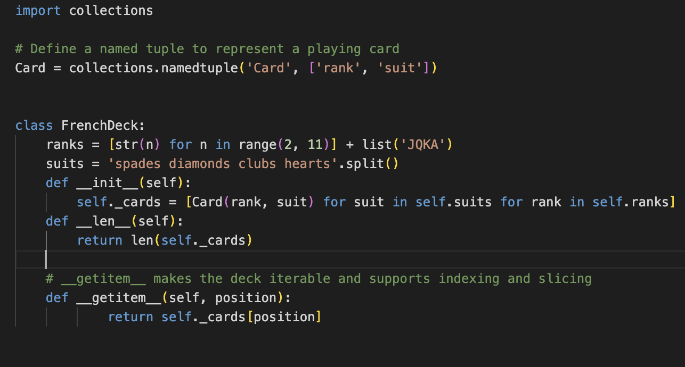

# Chapter 1: The Python Data Model

- **Python Data Model**: A framework that defines how objects behave in Python. It consists of a set of special methods (also called “dunder” or “magic” methods) that allow objects to integrate seamlessly with Python’s built-in features like iteration, operator overloading, and attribute access.

Magic method is slang for Special Methods

"Dunder" is a shortcut for "double underscore before and after."

Special methods are meant to be called by the python interpreter, and not by you. 

## A Pythonic Card Deck

This code demonstrates of implementing the two special methods, __getitem__ and __len__

## Vector class

This vector class implements special methods __repr__, __abs__, __add__, __mull__
 
 

## Special Methods

