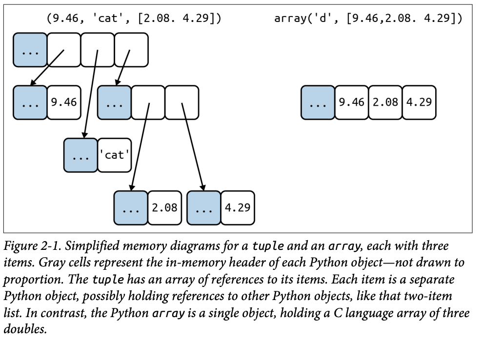
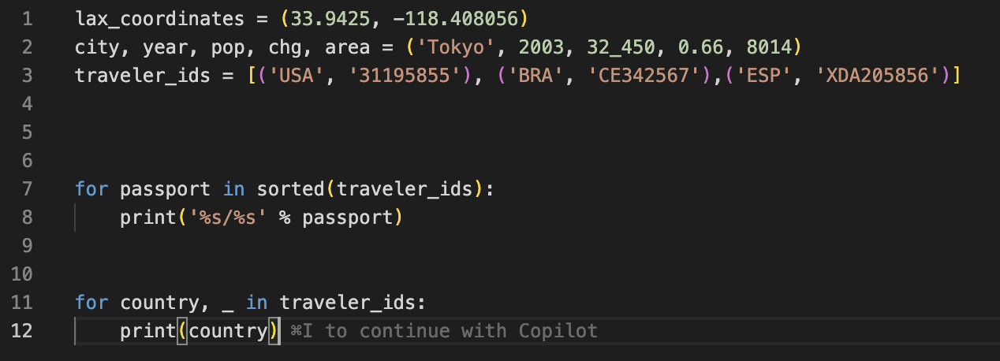
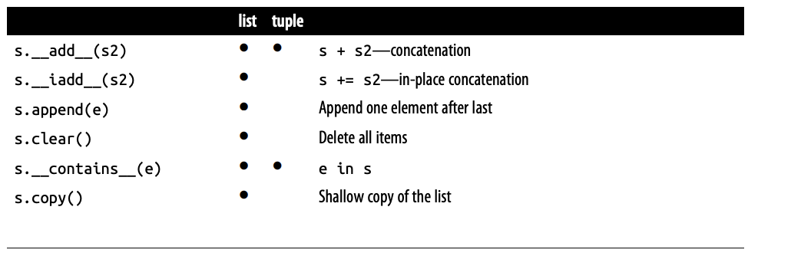
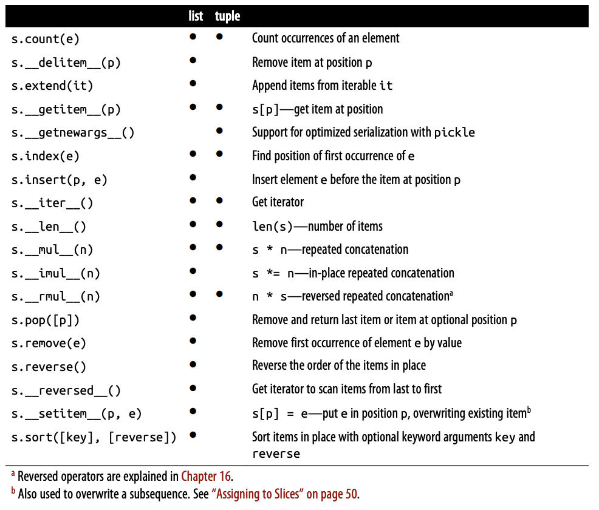

# Chapter 2 - An Array of Sequences 

A container sequence hold reference to the objects it contains, which may be of any type, while a flat sequence stores the value of it contents in it own memory space, not as distinct Python Objects.

Tuples are not just Immutable lists. Tuples do double duty: they can be used as immutavle lists and also as records with no field names. This use is sometime overlooked. 

You can see Tuple used as Record.

The Python interpreter and standard library make extensive use of tuples as immuta‐
ble lists, and so should you. This brings two key benefits:

Clarity:

When you see a tuple in code, you know its length will never change.

Performance:

A tuple uses less memory than a list of the same length, and it allows Python to do some optimizations.

# Comparing Tuple and List Methods

