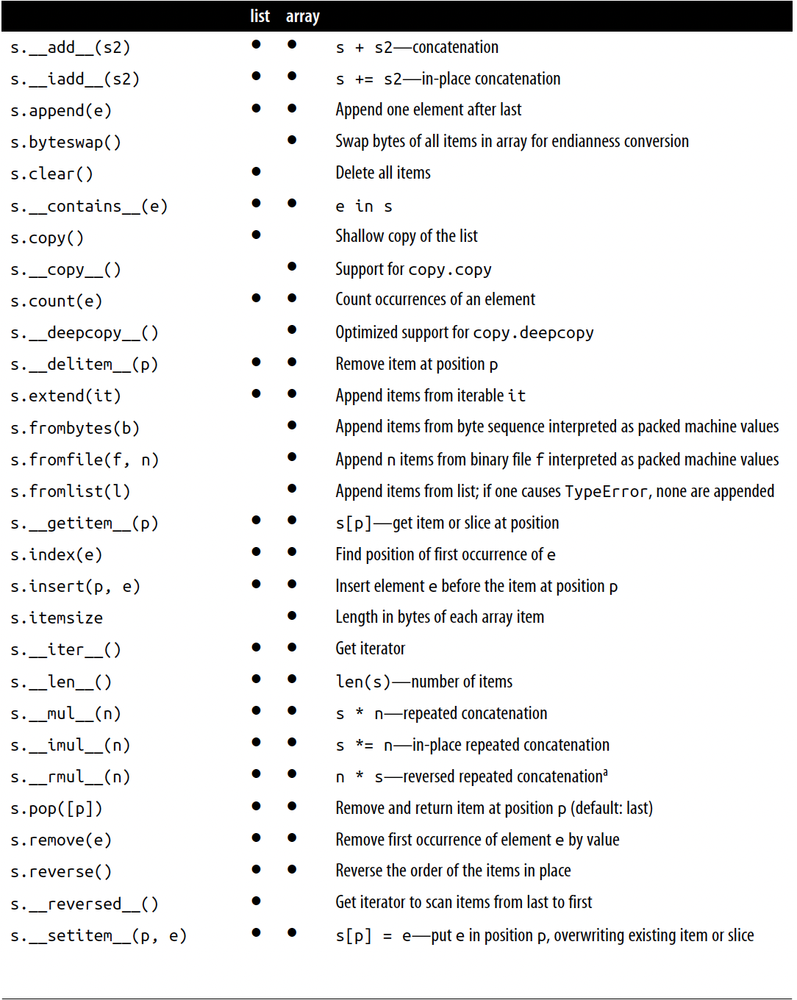

# Chapter 2 - An Array of Sequences 

*Container sequences*
    - Can hold items of different types, including nested containers. Some examples:
list, tuple, and collections.deque.

*Flat sequences*
    - Hold items of one simple type. Some examples: str, bytes, and array.array.


A container sequence hold reference to the objects it contains, which may be of any type, while a flat sequence stores the value of it contents in it own memory space, not as distinct Python Objects.


A flat sequences are more compact, but they are limited to holding primitive
machine values like bytes, integers, and floats.

*Mutable sequences*
    - For example, list, bytearray, array.array, and collections.deque.

*Immutable sequences*
    - For example, tuple, str, and bytes.


## Tuples Are Not Just Immutable Lists
Tuples are not just Immutable lists. Tuples do double duty: they can be used as immutavle lists and also as records with no field names. This use is sometime overlooked. 

You can see Tuple used as Record.


The Python interpreter and standard library make extensive use of tuples as immuta‐
ble lists, and so should you. This brings two key benefits:

Clarity:

When you see a tuple in code, you know its length will never change.

Performance:

A tuple uses less memory than a list of the same length, and it allows Python to do some optimizations.


## Comparing Tuple and List Methods


## Unpacking Sequences and Iterables
Unpacking is important because it avoids unnecessary and error-prone use of
indexes to extract elements from sequences.

```python

lax_coordinates = (33.9425, -118.408056)
latitude, longitude = lax_coordinates 

>>> latitude

33.9425

>>> longitude


-118.408056

```


## Using * to grab excess items

```python
a,b *rest = range(5)


 a, b, rest

(0,1,[2,3,4])
```

## Pattern Matching Sequence

New Feature in Python 3.10

```python
def handle_command(self, message):
    match message:
        case ['BEEPER', frequency, times]:
            self.beep(times, frequency)
        case ['NECK', angle]:
            self.rotate_neck(angle)
        case ['LED', ident, intensity]:
            self.leds[ident].set_brightness(ident, intensity)
        case ['LED', ident, red, green, blue]:
            self.leds[ident].set_color(ident, red, green, blue)
        case _:
            raise InvalidCommand(message)

command1=['LED', 4, 255, 0, 0]
command2=[ 'BEEPER', 440, 3]


```


## Nested Upacking

You can do nested upacking as long has it has the same structure

You can see the the Nested Unpacking code.

```python
metro_areas = [
('Tokyo', 'JP', 36.933, (35.689722, 139.691667)),
('Delhi NCR', 'IN', 21.935, (28.613889, 77.208889)),
('Mexico City', 'MX', 20.142, (19.433333, -99.133333)),
('New York-Newark', 'US', 20.104, (40.808611, -74.020386)),
('São Paulo', 'BR', 19.649, (-23.547778, -46.635833)),
]


def main():
    print(f'{"":15} | {"latitude":9} | {"longitude":9}')
    for name,_,_,(lat,lon) in metro_areas:
        print(f'{name:15} | {lat:9.4f} | {lon:9.4f}')

if __name__ == '__main__':
    main()

```

## Slice Objects
S[a:b:c] can be used to specify a stride or step c, causing the resulting slice to skip items. The stride allso be negative, returning the items in reverse


```python

s='bicycle'

s[::3]

'bye'

s[::-1]

'elcycib'

 s[::-2]

'eccb'

```

## Building Lists of Lists


In the example below: We can create list with three lists of length of 3 which can be used to represent tic-tac-toe

```python
board=[['_'] * 3 for i in range(3)]

[['_', '_', '_'], ['_', '_', '_'], ['_', '_', '_']]

```
## Augmented Assignment with Sequences

The augmented assignment operators += and *= behave quite differently, depending
on the first operand. 

The special method that makes += work is __iadd__ (for “in-place addition”)

The special method that makes *= work is __imul__

## list.sort() Versus the sorted Built-In

The `list.sort` method sorts a list in place, without making a copy.

`sorted` ceates a new list and returns it. It accepts any iterable object as an argument, including immutable sequences adn generators.

Both list.sort and sorted take two optional, keyword-only arguments:

reverse
    - If True, the items are returned in descending order (i.e., by reversing the comparison of the items). The default is False.
key
    - A one-argument function that will be applied to each item to produce its sorting key.

```python

fruits =['grape','raspberry','apple','banana']

sorted(fruits)
['apple', 'banana', 'grape', 'raspberry']
>>> fruits
['grape', 'raspberry', 'apple', 'banana']

>>> sorted(fruits, reverse=True)
['raspberry', 'grape', 'banana', 'apple']

>>> sorted(fruits, key=len)
['grape', 'apple', 'banana', 'raspberry']

>>> sorted(fruits, key=len, reverse=True)
['raspberry', 'banana', 'grape', 'apple']

>>> fruits
['grape', 'raspberry', 'apple', 'banana']

>>> fruits.sort()
fruits
['apple', 'banana', 'grape', 'raspberry']

```

## Comparing the features of list and array.array




## Deques and Other 

`.append` and `.pop` methods make a list usable as a stack or a queue (if you use .append and .pop(0), you get FIFO behavior).

The class collections.deque is a thread-safe double-ended queue designed for fast
inserting and removing from both ends.

```python

>>> from collections import deque
>>> dq = deque(range(10), maxlen=10)
>>> dq
deque([0, 1, 2, 3, 4, 5, 6, 7, 8, 9], maxlen=10)
>>> dq.rotate(3)
>>> dq
deque([7, 8, 9, 0, 1, 2, 3, 4, 5, 6], maxlen=10)

>>> dq.rotate(-4)
>>> dq
deque([1, 2, 3, 4, 5, 6, 7, 8, 9, 0], maxlen=10)

>>> dq.appendleft(-1)
>>> dq
deque([-1, 1, 2, 3, 4, 5, 6, 7, 8, 9], maxlen=10)

>>> dq.extend([11, 22, 33])
>>> dq
deque([3, 4, 5, 6, 7, 8, 9, 11, 22, 33], maxlen=10)

>>> dq.extendleft([10, 20, 30, 40])
>>> dq
deque([40, 30, 20, 10, 3, 4, 5, 6, 7, 8], maxlen=10)


```